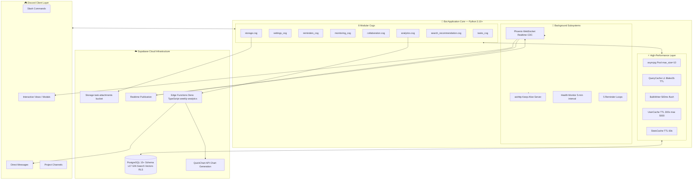

# 📝 To-Do List Bot Gen 3.0

### Enterprise-Grade Discord Productivity & Project Management System

> Powered by **Supabase PostgreSQL**, **Realtime CDC**, **9-Language NLP Date Engine**, and **Deno Edge Analytics** — engineered for teams and power users who demand reliability, transparency, and speed.

---


-brightgreen)


---

## 📑 Table of Contents

1. [✨ What's New in Gen 3.0](#-whats-new-in-gen-30)
2. [🏛️ System Architecture](#-system-architecture)
3. [🌐 9-Language Support & Smart Date Engine](#-9-language-support--smart-date-engine)
4. [📖 Slash Command Directory](#-slash-command-directory)
5. [🎛️ Interactive UI & Defensive Design](#-interactive-ui--defensive-design)
6. [⚡ Performance & Caching Architecture](#-performance--caching-architecture)
7. [🔄 Background Automation & Schedulers](#-background-automation--schedulers)
8. [🛡️ Security & Row Level Security (RLS)](#-security--row-level-security-rls)
9. [🌩️ Supabase Realtime & Edge Functions](#-supabase-realtime--edge-functions)
10. [🚀 Installation & Deployment Guide](#-installation--deployment-guide)
11. [⚙️ Environment Variables Reference](#-environment-variables-reference)
12. [🧪 Test Suite & Quality Assurance](#-test-suite--quality-assurance)

---

## ✨ What's New in Gen 3.0

Gen 3.0 is a complete architectural overhaul — not just an update. Every layer of the stack has been upgraded for cloud-native, multi-user, multi-language production use.

| Feature | Gen 1 | Gen 2 | **Gen 3.0 (Current)** |
|---|---|---|---|
| **Database** | SQLite (monolithic) | SQLite v7 | **Supabase PostgreSQL** via `asyncpg`, Schema v17 (Priority 0–7, Manual Progress %, RLS Policies) |
| **Architecture** | Monolithic | Modular Cogs | **Modular Cogs + BulkWriter + QueryCache + UserCache + StatsCache** |
| **Languages (i18n)** | 🇹🇭 Thai only | 🇹🇭 TH + 🇬🇧 EN | **9 Languages:** 🇹🇭 TH · 🇬🇧 EN · 🇨🇳 ZH · 🇯🇵 JA · 🇰🇷 KO · 🇪🇸 ES · 🇷🇺 RU · 🇫🇷 FR · 🇩🇪 DE |
| **Date Parsing** | Standard formats only | Standard + a few Thai | **NLP Date Engine** for all 9 languages (weekdays, Asian kanji/hangul, Thai Buddhist Era, European dots, relative deltas) |
| **Collaboration** | None | None | **Shared Projects** (`/project`), Kanban Board, Member Roles (Lead/Member/Viewer), Activity Log, **Project & Task Priority (0–7: ⬜ to 🆘)**, **Advance Progress & Manual %**, **Complete Project Dialog** |
| **Search** | Basic text match | Basic text match | **PostgreSQL Full-Text Search** (`search_vector` GIN index, `ts_rank_cd`, multi-column weighted ranking) |
| **AI Prioritization** | None | None | **`/recommend`** — Composite Scoring (Urgency + Priority + Staleness), 3 Strategy Presets |
| **File Attachments** | None | None | **Supabase Storage** (`/attach`, `/attachments`), image preview, per-task file management |
| **Realtime Sync** | None | None | **Supabase Realtime CDC** (Phoenix WebSocket), live Discord embed updates with 1.5s debounce |
| **Analytics** | None | None | **`/task-stats`** Productivity Dashboard + **Deno Edge Function** weekly visual reports via QuickChart API |
| **Monitoring** | None | None | **Health Monitor**, Error Tracker, Commands Audit, Discord Alert Dispatcher |
| **Automated Testing** | None | Not documented | **235 Unit & Integration Tests, 100% passing** |
| **Event Loop** | Default | Default | **uvloop** (Linux/macOS) for 2–4× faster I/O throughput |

---

## 🏛️ System Architecture



### Module Map

| Module | File(s) | Responsibility |
|---|---|---|
| `core/config.py` | `config.py` | Centralised env validation, frozen dataclasses for all subsystems |
| `core/database.py` | `database.py` | asyncpg pool, migrations (Schema v17), QueryCache, BulkWriter, UserCache, StatsCache |
| `core/security.py` | `security.py` | InputValidator, Token-bucket rate limiter, `@rate_limit_check` decorator |
| `handlers/tasks_cog.py` | `tasks_cog.py` | All personal task slash commands |
| `handlers/task_views.py` | `task_views.py` | TaskActionView, TaskListView, AddTaskModal, DeleteConfirmView, SnoozePresetView, persistent view registration |
| `handlers/settings_cog.py` | `settings_cog.py` | `/setup`, `/lang`, `/category`, `/help` |
| `handlers/reminders_cog.py` | `reminders_cog.py` | 5 background loops (reminder, recurring, daily digest, DM alarm, cleanup) |
| `handlers/monitoring_cog.py` | `monitoring_cog.py` | Admin `/health`, `/errors`, `/cmdstats`, `/monitoring` |
| `collaboration/` | `cog.py`, `models.py`, `service.py`, `views.py` | Shared Projects, Kanban Board, Member Roles, Activity Log, Project Priority 0–7, Advance & Complete Project controls |
| `storage/` | `cog.py`, `client.py`, `models.py`, `service.py`, `views.py` | Supabase Storage integration, `/attach`, `/attachments`, MIME type guards, presigned public URLs |
| `search_recommendation/` | `cog.py`, `fts_engine.py`, `models.py`, `protocols.py`, `query_builder.py`, `recommendation.py`, `service.py`, `views.py` | PostgreSQL FTS `/search` (tsvector GIN), Composite AI Scoring `/recommend` (Urgency + Priority + Staleness) |
| `analytics/` | `cog.py`, `client.py`, `models.py` | `/task-stats` productivity dashboard, `/analytics` weekly & on-demand Edge Function reports |
| `realtime/` | `client.py`, `dashboard_tracker.py`, `dispatcher.py`, `notifications.py`, `service.py` | Phoenix WebSocket CDC client, CDC event dispatcher, debounced embed updater, live dashboard rehydrator |
| `monitoring/` | `alert_dispatcher.py`, `commands_log.py`, `error_tracker.py`, `health_monitor.py`, `logger_setup.py` | Health monitor, error tracker, structured JSON logging, Discord alert dispatcher |
| `security_rls/` | `sql/*.sql`, `client.py`, `context.py`, `migration_runner.py` | PostgreSQL Row Level Security policies, scoped context managers, migration runner CLI (`--dry-run`/`--apply`/`--rollback`) |
| `locales/` | `th.py en.py zh.py ja.py ko.py es.py ru.py fr.py de.py` | 9-language string tables |
| `locales/i18n.py` | `i18n.py` | `t()` translation engine with `_SafeDict`, `DISCORD_LOCALE_MAP` |
| `utils/helpers.py` | `helpers.py` | `parse_deadline()` NLP engine, embed builders, `time_left_str()`, CSV export |
| `utils/conflict_resolver.py` | `conflict_resolver.py` | `validate_deadline_defensive()`, `DeadlineValidationError`, optimistic concurrency lock |
| `supabase/functions/weekly-analytics/` | `index.ts`, `chart_builder.ts`, `discord_delivery.ts`, `types.ts`, `deno.json` | Deno TypeScript Edge Function, QuickChart API chart generation, Discord DM delivery |

---

## 🌐 9-Language Support & Smart Date Engine

### Supported Languages

| Flag | Language | Code | Auto-detected from Discord locale |
|---|---|---|---|
| 🇹🇭 | Thai | `th` | `th` |
| 🇬🇧 | English | `en` | `en-US`, `en-GB` |
| 🇨🇳 | Chinese (Simplified) | `zh` | `zh-CN`, `zh-TW` |
| 🇯🇵 | Japanese | `ja` | `ja` |
| 🇰🇷 | Korean | `ko` | `ko` |
| 🇪🇸 | Spanish | `es` | `es-ES`, `es-419` |
| 🇷🇺 | Russian | `ru` | `ru` |
| 🇫🇷 | French | `fr` | `fr` |
| 🇩🇪 | German | `de` | `de` |

Users can manually override via `/lang` at any time. The bot auto-detects from the Discord client locale on first interaction (`DISCORD_LOCALE_MAP` in `locales/i18n.py`).

### Smart Date Parser (`utils/helpers.py` → `parse_deadline()`)

The date parsing engine understands natural language in all 9 languages. Every input is normalised, validated, and converted to a timezone-aware UTC datetime.

**1. Relative Deltas** (language-agnostic)

```
+30m  →  30 minutes from now
+2h   →  2 hours from now
+3d   →  3 days from now
+1w   →  1 week from now
```

**2. Natural Language Keywords**

| Language | Keywords |
|---|---|
| 🇹🇭 Thai | `วันนี้`, `พรุ่งนี้`, `มะรืนนี้` |
| 🇬🇧 English | `today`, `tomorrow`, `day after tomorrow` |
| 🇩🇪 German | `heute`, `morgen`, `übermorgen` |
| 🇪🇸 Spanish | `hoy`, `mañana`, `pasado mañana` |
| 🇫🇷 French | `aujourd'hui`, `demain`, `après-demain` |
| 🇯🇵 Japanese | `今日`, `明日`, `明後日` |
| 🇰🇷 Korean | `오늘`, `내일`, `모레` |
| 🇨🇳 Chinese | `今天`, `明天`, `后天` |
| 🇷🇺 Russian | `сегодня`, `завтра`, `послезавтра` |

**3. Weekday Names (All 9 Languages)**

```
monday / Montag / lundi / lunes / понедельник / 月曜日 / 월요일 / 周一
→ resolves to the next upcoming occurrence of that weekday
```

**4. Asian Date Formats**

```
2026年9月27日 18:00     →  Japanese Kanji  (year/month/day)
9月27日 15:30           →  Japanese short  (current year assumed)
2026년 9월 27일 18:00   →  Korean Hangul
9월 27일                →  Korean short
2026年9月27日           →  Chinese Hanzi
```

**5. Thai Buddhist Era (พ.ศ.)**

```
25/12/2569 18.00น.   →  auto-converted  (2569 − 543 = 2026 CE)
25/12/2569           →  date only, defaults to end of day
18.00น.              →  Thai time notation (period separator + น.)
```

**6. European Dot Dates**

```
27.09.2026 18:00
27.09.26   18:00
27.09            →  current year assumed
```

**7. Standard & Shorthand**

```
25/12/2026 18:00   →  DD/MM/YYYY HH:MM
25/12 18:00        →  DD/MM (current year assumed)
today 18:00        →  keyword + time
tomorrow 09:30
```

> **Note:** All deadlines are parsed relative to the **user's individual timezone** (set via `/setup`). A user in `Asia/Tokyo` and a user in `America/New_York` entering `tomorrow 09:00` will each receive the correct local time.

---

## 📖 Slash Command Directory

### 📝 Personal Task Management

| Command | Parameters | Description |
|---|---|---|
| `/add` | `[task]` `[deadline]` `[priority]` | Add a new task. Omit all params to open the full **AddTaskModal** (name, deadline, priority 0–7, description, tags). Quick-add: provide `task` inline. |
| `/list` | — | Paginated task list with filter dropdown (Pending, In\_Progress, Completed, Overdue, Cancelled, All, Today, Pinned). |
| `/today` | — | Tasks due today, sorted by deadline, with interactive **TodayView** buttons. |
| `/overdue` | — | All overdue tasks with **OverdueView** quick-action buttons. |
| `/task` | `task_id` | Full task detail embed with **TaskActionView** control panel. |
| `/done` | `task_id` | Mark task as Completed. Logs action to audit trail. |
| `/delete` | `task_id` | Delete task (with **DeleteConfirmView** confirmation dialog). |
| `/pin` | `task_id` | Pin task to top of list. |
| `/unpin` | `task_id` | Remove pin from task. |
| `/recurring` | `task_id` `interval` | Set recurring interval: `daily`, `weekly`, `monthly`, or `none` to remove. |
| `/stats` | — | Task summary with colour-coded progress bars (Pending / In\_Progress / Completed / Cancelled / Overdue). |
| `/task-stats` | — | Deep Productivity Dashboard: on-time rate, average turnaround days, lead/lag margin, completion velocity (tasks/week), productivity score 0–100. |
| `/digest` | — | On-demand daily digest: today's tasks, upcoming deadlines, overdue count. |
| `/export` | — | Export all tasks to a UTF-8 BOM CSV file (Excel-compatible). Rate-limited: 5/day. |

> **Priority Scale (0–7):**
> `0` ⬜ Normal / ปกติ · `1` 🟦 Low / ต่ำ · `2` 🟩 Medium / ปานกลาง · `3` 🟨 High / สูง · `4` 🟧 Urgent / ด่วน · `5` 🟥 Immediate / ด่วนมาก · `6` 🔴 Critical / วิกฤต · `7` 🆘 Emergency / ฉุกเฉิน

---

### 🤝 Shared Projects & Collaboration

All project commands are under the `/project` group and operate within the **current guild (server)** with full guild-tenancy isolation.

| Command | Parameters | Description |
|---|---|---|
| `/project create` | `[priority]` | Create a new shared project in the current server. Opens modal for name, description, emoji, color, and priority (0–7). |
| `/project list` | `[status]` | List server projects filtered by `Active` / `Completed` / `Archived` / `All`. Sorted by Priority (DESC) and recent activity. |
| `/project view` | `project_id` | Interactive **Project Dashboard** with metrics, member count, progress bar, navigation tabs, and action controls. |
| `/project board` | `project_id` | Interactive **Kanban Board** with column navigation buttons (Pending → In\_Progress → Completed). |
| `/project add-task` | `project_id` `[priority]` | Add a new task to the project with priority level 0–7, deadline, and tags. |
| `/project set-priority` | `project_id` `priority` | Update project priority (0–7: ⬜ Normal to 🆘 Emergency) on the fly (Lead or server Admin). |
| `/project complete-task` | `project_id` `task_id` | Mark a specific project task as Completed with a celebratory announcement embed. |
| `/project my-tasks` | — | All tasks across server projects assigned to the caller. |
| `/project members` | `project_id` | View and manage project members. Leads can assign roles: `lead`, `member`, `viewer`. |
| `/project add-member` | `project_id` `user` `[role]` | Add member (`member` or `lead`) to the project and automatically send a private Discord DM invite card. |
| `/project activity` | `project_id` | Paginated activity log for the project (task changes, member joins, status updates). |
| `/project archive` | `project_id` `[action]` | Archive project (`archived`) or conclude project (`completed`) (Lead or server Admin only). |
| `/project set-channel` | `project_id` `channel` | Set dedicated Discord channel for Realtime announcements and completion broadcasts (Lead or Admin). |

**Member Roles:**

- 👑 **Lead** — Full control: edit project, set priority/channel, manage members, archive/complete.
- 👤 **Member** — Create and manage tasks within the project.
- 👁️ **Viewer** — Read-only: view board, files, and activity.

---

### 🔍 Full-Text Search & AI-Ready Recommendations

| Command | Parameters | Description |
|---|---|---|
| `/search` | `query` `[status]` `[priority]` `[sort]` `[scope]` `[page_size]` | Full-text search powered by PostgreSQL `search_vector` (GIN index) and `ts_rank_cd`. Supports personal or guild-wide scope. Filterable and sortable. |
| `/recommend` | `[limit]` `[scope]` `[preset]` | Smart task prioritisation using a composite scoring formula. Returns ranked list of tasks to focus on next. |

**`/search` options:**
- `scope`: `personal` (default) | `guild`
- `sort`: `relevance` | `deadline` | `priority` | `created`

**`/recommend` scoring presets:**
- `balanced` (default) — equal weight on urgency, priority, staleness
- `urgency` — deadline proximity dominates
- `priority` — user-set priority dominates

---

### 📎 Task Attachments & Storage

| Command | Parameters | Description |
|---|---|---|
| `/attach` | `task_id` `file` | Upload a file to the task. Stored in Supabase Storage (`task-attachments` bucket). Images show inline preview. Notifies project channel if task belongs to a project. |
| `/attachments` | `task_id` | List all attachments for a task with download links and metadata. Option to delete individual files. |

**Supported file types:** `png`, `jpg`, `jpeg`, `gif`, `webp`, `pdf`, `docx`, `xlsx`, `pptx`, `txt`, `csv`, `md`, `zip`

**Max file size:** configurable via `MAX_ATTACHMENT_SIZE_MB` (default: 15 MB)

---

### 📊 Analytics & Visual Reports

| Command | Parameters | Description |
|---|---|---|
| `/analytics snapshot` | — | Trigger an on-demand weekly productivity report. Calls the **Supabase Edge Function** which computes metrics and generates charts via QuickChart API. Report delivered to your DM. |
| `/analytics weekly` | `enabled` | Toggle automatic weekly DM report on/off (`true` / `false`). |
| `/task-stats` | — | In-Discord productivity dashboard (no DM required). |

---

### ⚙️ Settings & Configuration

| Command | Parameters | Description |
|---|---|---|
| `/setup` | `timezone` `[channel]` | Set your personal timezone (IANA format, e.g. `Asia/Bangkok`) and notification channel. |
| `/lang` | — | Switch language via interactive 9-button menu. Change takes effect immediately. |
| `/category list` | — | List all available task categories (system + personal). |
| `/category add` | `name` `emoji` | Create a personal task category with a custom emoji. |
| `/category remove` | `name` | Delete a personal category. |
| `/help` | — | Full command reference card in your current language. |

---

### 🏥 Monitoring, Diagnostics & Administration

> Commands in this group are restricted to bot owners (`BOT_OWNER_IDS`) or server admins.

| Command | Access | Description |
|---|---|---|
| `/health` | Admin | System health dashboard: DB ping latency, memory RSS/%, event loop lag, Discord API latency, uptime. |
| `/errors` | Admin | Last 24-hour error summary grouped by error type and frequency. |
| `/cmdstats` | Admin | Command call statistics — total invocations, error rate, top commands. |
| `/monitoring setup` | Admin | Configure server-specific error alert channel and enable/disable monitoring. |
| `/monitoring status` | Admin | Current monitoring configuration for this server. |
| `/admin stats` | Owner | Global bot statistics: total users, tasks, guilds, DB pool state. |
| `/admin cache_purge` | Owner | Force-purge all expired QueryCache and UserCache entries. |

---

## 🎛️ Interactive UI & Defensive Design

### 📝 Personal Task Panel (`TaskActionView`)

Every personal task embed comes with a persistent 5-row button panel:

| Row | Components |
|---|---|
| 1 | ✅ Done · 📝 Edit · 📌 Pin/Unpin |
| 2 | 🗑️ Delete · ⏰ Snooze (preset picker) |
| 3 | ➕ Add Subtask |
| 4 | 🏷️ Category dropdown (loaded dynamically) |
| 5 | ⚡ Priority dropdown (0–7: ⬜ Normal to 🆘 Emergency) |

### 🤝 Project Dashboard Panel (`ProjectDashboardView`)

Project dashboards (`/project view`) feature a dual-row interactive control panel adhering to Discord's 5-button-per-row layout rules:

| Row | Type | Components & Capabilities |
|---|---|---|
| **Row 0** | **Navigation Tabs** | 📊 **Dashboard** (metrics & summary) · 📋 **Board** (interactive Kanban) · 👥 **Members** (roster & roles) · 📜 **Activity** (audit feed) · 📁 **Files** (attachments) |
| **Row 1** | **Action Controls** | ➕ **Add Task** (`AddProjectTaskModal` with priority 0–7)<br>📈 **Advance Progress** (`AdvanceProgressSelectView` / `ManualProgressView`)<br>🏁 **Complete Project** (`ProjectCompleteConfirmView`)<br>🎯 **Priority** (`ProjectPrioritySelectView` 0–7 dropdown) |

#### Interactive Progress & Completion Controls

- **📈 Advance Progress**:
  - If the project has active tasks: opens `AdvanceProgressSelectView` with an interactive select menu listing remaining tasks. Selecting a task marks it Completed and automatically updates progress metrics. Also includes a button to switch to manual % adjustment.
  - If no tasks exist or manual mode is selected: opens `ManualProgressView` with quick preset buttons (`+10%`, `+25%`, `+50%`, `100%`) and a modal button for custom percentage values (0–100%).
- **🏁 Complete Project**:
  - Opens `ProjectCompleteConfirmView` with dual completion options:
    1. **Mark Project & All Tasks Completed**: Automatically sets status of all remaining project tasks to `Completed`.
    2. **Complete Project Only**: Concludes project status while keeping task states intact.
  - Enforces role protection: only Project Owner, Lead, or Server Admin can perform completion.
- **🎯 Project Priority Selector**:
  - `ProjectPrioritySelectView` provides an interactive select menu displaying all 8 priority levels (⬜ 0 to 🆘 7). Updates project priority and sorts server project lists accordingly.

### Persistent View Registration

On bot startup, `register_all_persistent_views()` rehydrates all active TaskActionViews:

- Queries tasks within `PERSISTENT_VIEWS_MAX_DAYS` days (default: 30) with a single `IN (...)` batch query — **zero N+1 queries**
- Capped at `PERSISTENT_VIEWS_LIMIT` (default: 500) views to protect memory
- Category dropdowns are pre-loaded in bulk per restored view

### Interaction Safety

| Pattern | Implementation |
|---|---|
| **Defer & Followup** | All commands call `response.defer()` before any async DB work to stay within Discord's 3-second timeout |
| **on_error handler** | Every Cog has `cog_app_command_error` that catches and responds gracefully — no silent failures |
| **TaskConflictView** | Optimistic concurrency check via `validate_deadline_defensive()` — if another user modifies a task between the user opening and submitting the edit modal, a conflict is detected and the user is warned |
| **DeleteConfirmView** | Two-step confirmation before any irreversible delete |
| **SnoozePresetView** | Ephemeral snooze picker with preset options so users don't need to type a new deadline |

---

## ⚡ Performance & Caching Architecture

### asyncpg Connection Pool

```
max_size              = DB_POOL_SIZE  (default: 10)
command_timeout       = DB_TIMEOUT    (default: 30s)
max_inactive_lifetime = 300s          ← auto-recycles connections Supabase/pgBouncer silently closes
server_settings       = {timezone: UTC, application_name: "todo-bot"}
statement_cache_size  = 0             ← disabled for pgBouncer session-mode compatibility
```

All queries use PostgreSQL `$N`-style positional placeholders. A jittered exponential-backoff retry (up to 3 attempts) covers transient `asyncpg.TooManyConnectionsError` and `asyncpg.InterfaceError`.

### Multi-Level Caching

```
┌──────────────────────────────────────────────────────────────┐
│  L0  Discord Interaction Response Cache  (discord.py)        │
├──────────────────────────────────────────────────────────────┤
│  L1  QueryCache — Blake2b(SQL + params) keyed TTL store      │
│       TTL:          DB_QUERY_CACHE_TTL  (default: 30.0s)     │
│       Invalidation: table-scoped  (tasks, users, projects)   │
├──────────────────────────────────────────────────────────────┤
│  L2  UserCache — per-user lang / timezone / channel / role   │
│       TTL:  300s  |  Max: 5,000 users  (FIFO eviction)       │
├──────────────────────────────────────────────────────────────┤
│  L3  StatsCache — per-user task count snapshot               │
│       TTL:  60s   |  Invalidated on task create / update     │
└──────────────────────────────────────────────────────────────┘
```

### BulkWriter (Write-Batching Queue)

Instead of hitting the database for every audit log INSERT, the BulkWriter accumulates items in a `deque` and flushes them atomically in a single `executemany` transaction every `DB_BULK_WRITE_INTERVAL_MS` (default: 500ms).

- **Poison-item protection:** failed items that cannot be re-parsed are discarded with a warning rather than blocking the queue
- **Re-queue on failure:** transient DB failures re-enqueue items for the next flush cycle
- **Graceful shutdown:** the BulkWriter is explicitly flushed during bot shutdown (before `db.close()`) to prevent data loss

### uvloop Guard

```python
# main.py — transparent uvloop opt-in
try:
    import uvloop
    asyncio.set_event_loop_policy(uvloop.EventLoopPolicy())
except ImportError:
    pass   # Windows or package missing — silently falls back to default
```

On Linux/macOS, this provides **2–4× faster** async I/O throughput.

---

## 🔄 Background Automation & Schedulers

All loops run in `handlers/reminders_cog.py` and start automatically after `setup_hook()` completes.

| Loop | Interval | Function |
|---|---|---|
| `reminder_loop` | `REMINDER_INTERVAL_MIN` (default 30 min) | Scans for tasks due within 1 hour or already overdue. Sends channel reminders with a 0.3s throttle between messages to avoid Discord rate-limiting. Re-alerts overdue tasks every `OVERDUE_REMIND_HOURS` hours. |
| `recurring_loop` | `RECURRING_INTERVAL_MIN` (default 60 min) | Finds completed recurring tasks and automatically creates the next instance (daily / weekly / monthly) with the same name, priority, and tags. |
| `daily_digest_loop` | Every 1 minute (checks per user timezone) | Sends each user their personalised daily digest at their configured local time (default 08:00). Includes today's tasks, tomorrow's preview, and overdue count. |
| `deadline_dm_loop` | `DM_REMINDER_INTERVAL_MIN` (default 15 min) | Sends a private DM at **24h**, **3h**, and **1h** before deadline. Uses a `dm_reminded` integer bitmask (bit 0=24h, 1=3h, 2=1h) to deduplicate — each DM fires exactly once per deadline. |
| `cleanup_loop` | Every 10 minutes | Purges expired `UserCache`, `StatsCache`, `QueryCache` entries, and expired token-bucket rate-limit windows. |

---

## 🛡️ Security & Row Level Security (RLS)

### Input Validation

All user text inputs pass through `core/security.py` → `InputValidator`:

- Max length enforcement (`MAX_TASK_NAME_LENGTH`, `MAX_DESCRIPTION_LENGTH`, `MAX_INPUT_LENGTH`)
- Pattern detection for common SQL injection probes (e.g. `; DROP`, `UNION SELECT`)
- HTML/script tag stripping and null-byte removal

### Rate Limiting

A **token-bucket multi-bucket rate limiter** operates per-user:

| Bucket | Default Limit | Block Duration |
|---|---|---|
| Commands | 30 per minute | `RATE_BLOCK_SECONDS` (default 300s) |
| Task creation | 100 per hour | `RATE_BLOCK_SECONDS` |
| Searches | 10 per minute | `RATE_BLOCK_SECONDS` |
| CSV exports | 5 per day | `RATE_BLOCK_SECONDS` |

Rate-limited responses include the **exact seconds remaining** until unblock, in the user's language.

### PostgreSQL Row Level Security (RLS)

RLS policies are managed as versioned SQL migrations in `security_rls/`:

| File | Scope |
|---|---|
| `01_rls_functions.sql` | Helper functions: `current_app_user()`, `is_project_member()`, `is_project_lead()` |
| `02_rls_tasks.sql` | Task isolation: owners see only their own tasks; project members see project tasks |
| `03_rls_projects_and_members.sql` | Project and membership visibility |
| `04_rls_categories_attachments.sql` | Category ownership, attachment access control |

**Runtime enforcement:** The bot sets `SET LOCAL app.current_user_id = $uid` at the start of every transaction. The RLS `current_app_user()` function reads this value to enforce isolation. No user can read or modify another user's data, even with a direct DB connection using the same credentials.

**Migration Runner CLI:**

```bash
# Preview SQL that will be applied (safe, no DB changes)
python -m security_rls.migration_runner --dry-run

# Apply all RLS policies to Supabase
python -m security_rls.migration_runner --apply

# Export combined SQL for Supabase SQL Editor
python -m security_rls.migration_runner --export

# Rollback — remove all RLS policies
python -m security_rls.migration_runner --rollback
```

---

## 🌩️ Supabase Realtime & Edge Functions

### Supabase Realtime (Phoenix WebSocket CDC)

The `realtime/` module maintains a persistent WebSocket connection to Supabase's Realtime server using the **Phoenix protocol**.

```
Bot startup
  └─ RealtimeClient.connect()
       └─ Subscribes to:
            • postgres_changes on table "tasks"                → task INSERT/UPDATE/DELETE
            • postgres_changes on table "project_activity_log" → activity INSERT
  └─ On CDC event received:
       └─ RealtimeDispatcher.dispatch()
            └─ Debounce 1.5s  (SUPABASE_REALTIME_DEBOUNCE_SEC)
            └─ Fetches updated row from DB
            └─ Re-renders Discord embed
            └─ discord.Message.edit()  ← live update, no new message sent
```

| Config Variable | Default | Purpose |
|---|---|---|
| `SUPABASE_REALTIME_ENABLED` | `true` | Master on/off switch |
| `SUPABASE_REALTIME_HEARTBEAT_SEC` | `30` | WebSocket keepalive ping interval |
| `SUPABASE_REALTIME_DEBOUNCE_SEC` | `1.5` | Collapse rapid changes before re-rendering |
| `SUPABASE_REALTIME_RECONNECT_BASE_SEC` | `1.0` | Exponential backoff base on disconnect |
| `SUPABASE_REALTIME_MAX_RECONNECT` | `0` | Max reconnect attempts (0 = infinite) |

### Supabase Edge Function (`weekly-analytics`)

Located in `supabase/functions/weekly-analytics/index.ts` — a **Deno TypeScript** serverless function.

**What it does:**
1. Reads `DISCORD_BOT_TOKEN` from Supabase Secrets (not `.env` — never exposed in source)
2. Queries productivity metrics for the requesting user over the past 7 days
3. Calls **QuickChart API** to render a bar/line chart as a PNG image
4. Sends a rich embed with the chart image directly to the user's Discord DM

**Trigger modes:**
- **On-demand:** `/analytics snapshot` → Bot makes an authenticated HTTP call to the Edge Function URL
- **Scheduled (Cron):** runs automatically every Monday at 08:00 UTC for users with weekly reports enabled

**Deploy commands:**

```bash
# Deploy to Supabase
supabase functions deploy weekly-analytics

# Schedule the weekly cron trigger
supabase functions schedule weekly-analytics --cron "0 8 * * 1"

# Test locally with Supabase CLI
supabase functions serve weekly-analytics

# Set the Discord token as a Supabase Secret (required — never put in .env)
supabase secrets set DISCORD_BOT_TOKEN=<your-token>
```

---

## 🚀 Installation & Deployment Guide

### Prerequisites

- **Python 3.10+** (3.14 recommended)
- **Supabase account** (free tier sufficient) — [supabase.com](https://supabase.com)
- **Discord application** with a bot token — [discord.com/developers](https://discord.com/developers/applications)
- *(Optional)* **Supabase CLI** for Edge Functions and RLS migrations

### Local Setup

```bash
# 1. Clone the repository
git clone https://github.com/Punk1107/todo-list-bot-gen2.git
cd "todo-list-bot-gen2"

# 2. Create and activate a virtual environment
python -m venv venv

# Windows
venv\Scripts\activate
# Linux / macOS
source venv/bin/activate

# 3. Install dependencies
pip install -r requirements.txt

# 4. Configure environment
copy .env.example .env      # Windows
cp .env.example .env        # Linux / macOS

# 5. Edit .env — fill in DISCORD_TOKEN and SUPABASE_* credentials
python main.py
```

### Discord Bot Configuration

In the [Discord Developer Portal](https://discord.com/developers/applications):

1. **Bot → Privileged Gateway Intents:** enable `Server Members Intent` and `Message Content Intent`
2. **OAuth2 → URL Generator:** scopes `bot` + `applications.commands`, permissions: `Send Messages`, `Embed Links`, `Attach Files`, `Read Message History`, `Use Slash Commands`
3. Copy the generated URL and invite the bot to your server

### Supabase Setup

1. Create a new Supabase project
2. From **Project Settings → Database → Connection string (Direct connection)**, copy `SUPABASE_HOST`, `SUPABASE_USER`, `SUPABASE_PASSWORD`, `SUPABASE_DB`
3. From **Project Settings → API**, copy **Project URL** → `SUPABASE_URL` and **service\_role key** → `SUPABASE_KEY`
4. The database schema (all 17 migration versions) runs **automatically** on first `python main.py`
5. *(Optional)* Apply RLS policies: `python -m security_rls.migration_runner --apply`

### Cloud Deployment (Render / Railway / Heroku)

The bot includes a built-in **aiohttp async keep-alive web server** for uptime monitoring platforms:

| Endpoint | Response |
|---|---|
| `GET /` | `{"status": "ok", "bot": "running"}` |
| `GET /health` | Full health JSON (DB latency, memory, loop lag) |
| `GET /ready` | `{"ready": true}` once bot is fully initialised |
| `GET /metrics` | Runtime metrics for Prometheus/Grafana scraping |

Set the `PORT` environment variable (Render/Railway auto-inject this) — the server reads `PORT` first, then falls back to `WEBSERVER_PORT`.

---

## ⚙️ Environment Variables Reference

Copy `.env.example` to `.env` and fill in the required values.

### Required

| Variable | Description |
|---|---|
| `DISCORD_TOKEN` | Your Discord bot token (from Developer Portal) |
| `SUPABASE_HOST` | PostgreSQL host from Supabase connection string |
| `SUPABASE_USER` | PostgreSQL username |
| `SUPABASE_PASSWORD` | PostgreSQL password |

### Bot Settings

| Variable | Default | Description |
|---|---|---|
| `DEFAULT_TIMEZONE` | `Asia/Bangkok` | Default timezone for new users (IANA format) |
| `DEFAULT_LANG` | `th` | Default language: `th` `en` `zh` `ja` `ko` `es` `ru` `fr` `de` |
| `BOT_OWNER_IDS` | _(empty)_ | Comma-separated Discord user IDs with owner-level admin access |
| `PERSISTENT_VIEWS_MAX_DAYS` | `30` | Restore task action buttons for tasks created within this many days |
| `PERSISTENT_VIEWS_LIMIT` | `500` | Max number of persistent views to restore on startup |

### Database

| Variable | Default | Description |
|---|---|---|
| `SUPABASE_DB` | `postgres` | Database name |
| `SUPABASE_PORT` | `5432` | Database port |
| `DB_POOL_SIZE` | `10` | asyncpg connection pool max size |
| `DB_TIMEOUT` | `30` | Query timeout in seconds |
| `DB_QUERY_CACHE_TTL` | `30.0` | L1 QueryCache TTL in seconds (0 = disable) |
| `DB_BULK_WRITE_INTERVAL_MS` | `500` | BulkWriter flush interval in milliseconds |

### Rate Limiting

| Variable | Default | Description |
|---|---|---|
| `RATE_COMMANDS_PER_MIN` | `30` | Max commands per minute per user |
| `RATE_TASKS_PER_HOUR` | `100` | Max task creations per hour per user |
| `RATE_SEARCHES_PER_MIN` | `10` | Max `/search` calls per minute per user |
| `RATE_EXPORTS_PER_DAY` | `5` | Max CSV exports per day per user |
| `RATE_BLOCK_SECONDS` | `300` | Block duration (seconds) after limit exceeded |
| `MAX_TASK_NAME_LENGTH` | `200` | Maximum task name character length |
| `MAX_DESCRIPTION_LENGTH` | `1000` | Maximum task description character length |

### Notifications

| Variable | Default | Description |
|---|---|---|
| `REMINDER_INTERVAL_MIN` | `30` | How often (minutes) to check and send deadline reminders |
| `RECURRING_INTERVAL_MIN` | `60` | How often (minutes) to renew recurring tasks |
| `OVERDUE_REMIND_HOURS` | `6` | Hours between re-notifications for overdue tasks |
| `DAILY_SUMMARY_ENABLED` | `true` | Enable/disable daily digest |
| `DAILY_SUMMARY_HOUR` | `8` | Local hour (0–23) to send daily digest |
| `DM_REMINDER_INTERVAL_MIN` | `15` | How often (minutes) to check for DM deadline alarms |

### Keep-Alive Web Server

| Variable | Default | Description |
|---|---|---|
| `WEBSERVER_ENABLED` | `true` | Enable the aiohttp keep-alive server |
| `WEBSERVER_HOST` | `0.0.0.0` | Bind address |
| `WEBSERVER_PORT` | `8080` | Port (overridden by `PORT` env var on cloud platforms) |

### Monitoring & Logging

| Variable | Default | Description |
|---|---|---|
| `MONITORING_ENABLED` | `true` | Master switch for health monitoring |
| `ADMIN_LOG_CHANNEL_ID` | _(empty)_ | Discord channel ID for error/health alerts |
| `HEALTH_CHECK_INTERVAL_MIN` | `5` | Health check frequency in minutes |
| `ALERT_RATE_LIMIT_SEC` | `300` | Minimum seconds between repeated alerts for the same error type |

Log files are created automatically in `logs/`:
- `logs/bot.log` — INFO+ (rotating 5 MB × 5 backups)
- `logs/errors.log` — WARNING+ with guild/user/command context (2 MB × 10 backups)
- `logs/commands.log` — JSON audit trail of every command invocation (10 MB × 7 backups)

### Supabase Realtime & Storage

| Variable | Default | Description |
|---|---|---|
| `SUPABASE_URL` | _(required)_ | Project REST URL: `https://<ref>.supabase.co` |
| `SUPABASE_KEY` | _(required)_ | `service_role` key. **Keep secret — never expose publicly.** |
| `SUPABASE_REALTIME_ENABLED` | `true` | Enable/disable Realtime WebSocket CDC |
| `SUPABASE_REALTIME_HEARTBEAT_SEC` | `30` | WebSocket ping interval |
| `SUPABASE_REALTIME_DEBOUNCE_SEC` | `1.5` | Debounce delay before re-rendering embed |
| `SUPABASE_REALTIME_RECONNECT_BASE_SEC` | `1.0` | Exponential backoff base on disconnect |
| `SUPABASE_REALTIME_MAX_RECONNECT` | `0` | Max reconnect attempts (0 = infinite) |
| `SUPABASE_STORAGE_ENABLED` | `true` | Enable/disable file attachment feature |
| `SUPABASE_STORAGE_BUCKET` | `task-attachments` | Storage bucket name |
| `MAX_ATTACHMENT_SIZE_MB` | `15` | Max file size in MB per attachment |
| `SUPABASE_STORAGE_ALLOWED_EXT` | `png,jpg,jpeg,gif,webp,pdf,docx,xlsx,pptx,txt,csv,md,zip` | Comma-separated allowed file extensions |

---

## 🧪 Test Suite & Quality Assurance

The project has **235 automated tests** covering all major subsystems, all passing at 100%.

```bash
# Run the full test suite
pytest

# With verbose output
pytest -v

# Run a specific module
pytest tests/test_collaboration_scope.py -v
```

### Test Coverage by Module

| Test File | Tests | Coverage Area |
|---|---|---|
| `test_analytics.py` | 23 | Productivity metrics calculation, turnaround formulas, scoring models, Edge Function client |
| `test_collaboration_scope.py` | 37 | Project CRUD, member roles, activity log, priority (0–7), advance progress, complete project |
| `test_conflict_resolution.py` | 25 | Defensive deadline validation, duplicate task suggestions, defensive snoozing |
| `test_date_parser_i18n.py` | 10 | 9-language natural date parsing (Buddhist Era, Asian Kanji/Hangul, European dots) |
| `test_locales.py` | 9 | Complete 1:1 translation key parity across all 9 supported languages |
| `test_realtime.py` | 15 | Phoenix WebSocket CDC client, heartbeat, debounced embed updater, reconnection |
| `test_reminders.py` | 1 | Background reminder loop query parameter types and timezone compatibility |
| `test_rls_policies.py` | 11 | PostgreSQL RLS policy parsing, session user context isolation, migration runner |
| `test_search_recommendation.py` | 51 | PostgreSQL Full-Text Search (`tsvector`, `ts_rank_cd`) & AI recommendation scoring presets |
| `test_sql_split.py` | 5 | SQL parser tokenizer (dollar-quotes `$$`, block comments, semicolons) |
| `test_storage.py` | 22 | Supabase Storage client, file size & MIME validation, object storage paths |
| `test_ux_improvements.py` | 26 | Persistent view rehydration, modal components, task autocomplete, subtask rendering |
| **Total** | **235** | **100% Passing Test Suite** |

> **Note on `test_locales.py`:** This test is the primary guard against cross-language regressions. When a new string key is added to the English/Thai locale, the test immediately fails for any of the other locale files missing that key — preventing the "feature works in Thai but crashes in German" class of bug.

---

## 📁 Project Structure

```
.
├── main.py                         # Bot entry point, Cog loader, graceful shutdown
├── requirements.txt                # Python dependencies
├── .env.example                    # Full environment variable template
│
├── core/
│   ├── config.py                   # Centralised env validation (frozen dataclasses)
│   ├── database.py                 # asyncpg pool, migrations (v1-v17), QueryCache, BulkWriter
│   └── security.py                 # InputValidator, token-bucket rate limiter
│
├── handlers/
│   ├── tasks_cog.py                # Personal task slash commands
│   ├── task_views.py               # Discord UI (TaskActionView, Modals, persistent registration)
│   ├── settings_cog.py             # /setup /lang /category /help
│   ├── reminders_cog.py            # 5 background automation loops
│   └── monitoring_cog.py           # Admin /health /errors /cmdstats /monitoring
│
├── locales/
│   ├── i18n.py                     # t() engine, _SafeDict, DISCORD_LOCALE_MAP
│   ├── th.py                       # Thai (Reference table)
│   ├── en.py                       # English
│   ├── zh.py                       # Chinese
│   ├── ja.py                       # Japanese
│   ├── ko.py                       # Korean
│   ├── es.py                       # Spanish
│   ├── ru.py                       # Russian
│   ├── fr.py                       # French
│   └── de.py                       # German
│
├── collaboration/
│   ├── cog.py                      # /project command group (13 slash commands)
│   ├── models.py                   # Project, ProjectMember, ProjectTask, BoardData models
│   ├── service.py                  # Project CRUD, priority, advance progress, completion service
│   └── views.py                    # ProjectDashboardView, Kanban, Modals, Priority & Progress controls
│
├── search_recommendation/
│   ├── cog.py                      # /search (FTS) + /recommend (AI scoring)
│   ├── fts_engine.py               # PostgreSQL ts_rank_cd full-text engine
│   ├── query_builder.py            # Sanitised SQL builder for FTS & filter search
│   ├── recommendation.py           # Composite multi-rule scoring engine
│   ├── models.py                   # Search query, filter, and score breakdown models
│   ├── protocols.py                # Protocols and interfaces
│   ├── service.py                  # Search and recommendation business logic
│   └── views.py                    # Paginated search results and recommendation views
│
├── storage/
│   ├── cog.py                      # /attach /attachments (Supabase Storage)
│   ├── client.py                   # Supabase Storage HTTP client
│   ├── models.py                   # TaskAttachment model
│   ├── service.py                  # File upload, size/extension validation, path builder
│   └── views.py                    # Attachment browser and management views
│
├── analytics/
│   ├── cog.py                      # /task-stats /analytics (Edge Function caller)
│   ├── client.py                   # Supabase Edge Function HTTP caller
│   └── models.py                   # Productivity analytics data models
│
├── realtime/
│   ├── client.py                   # Phoenix WebSocket client
│   ├── dispatcher.py               # CDC postgres_changes event dispatcher
│   ├── dashboard_tracker.py        # Active dashboard message tracker
│   ├── notifications.py            # Channel notification helpers
│   └── service.py                  # Realtime lifecycle manager
│
├── monitoring/
│   ├── health_monitor.py           # Heartbeat and resource telemetry
│   ├── error_tracker.py            # 24-hour error aggregator
│   ├── alert_dispatcher.py         # Rate-limited Discord alert webhook/channel dispatcher
│   ├── commands_log.py             # Structured JSON command audit logger
│   └── logger_setup.py             # Multi-handler logging configurator
│
├── security_rls/
│   ├── sql/                        # 4 versioned RLS SQL migration files
│   ├── client.py                   # Scoped RLS database client
│   ├── context.py                  # ContextVar scoped user session manager
│   └── migration_runner.py         # CLI tool for RLS migrations (--dry-run/apply/rollback)
│
├── utils/
│   ├── helpers.py                  # parse_deadline() 9-lang NLP engine, embed builders, CSV export
│   ├── conflict_resolver.py        # validate_deadline_defensive(), concurrency lock
│   └── webserver.py                # aiohttp async keep-alive health/metrics server
│
├── supabase/
│   └── functions/
│       └── weekly-analytics/
│           ├── index.ts            # Deno TypeScript Edge Function entrypoint
│           ├── chart_builder.ts    # QuickChart API visual chart builder
│           ├── discord_delivery.ts # Direct Message delivery engine
│           ├── types.ts            # TypeScript interfaces
│           └── deno.json           # Deno configuration & import map
│
├── tests/                          # 235 automated tests (pytest, 100% passing)
├── logs/                           # Auto-created: bot.log, errors.log, commands.log
└── data/                           # Reserved directory (schema auto-migrates on startup)
```

---

## 📄 License

This project is licensed under the **MIT License**.

---

<div align="center">

**📝 To-Do List Bot Gen 3.0**

*Built for teams who take productivity seriously.*

[Report a Bug](https://github.com/Punk1107/todo-list-bot-gen2/issues) · [Request a Feature](https://github.com/Punk1107/todo-list-bot-gen2/issues)

</div>
